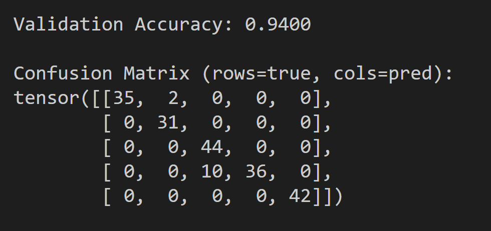
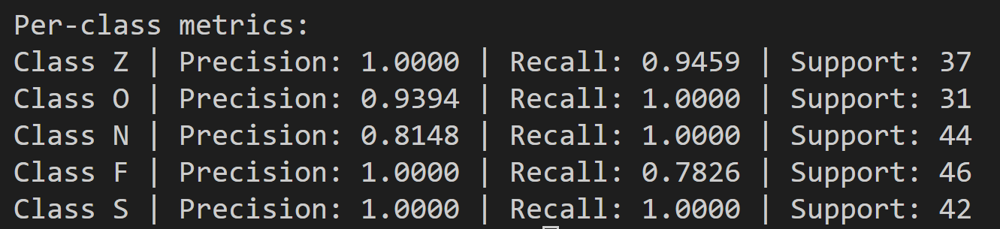

# EEG Seizure Classification

This project uses a Convolutional Neural Network (CNN) to classify EEG signals into different brain activity states, including epileptic seizures.

The model is trained on the Bonn University EEG dataset and achieves high accuracy (~98%) on validation data.

---

## Dataset

The dataset used is the Bonn University EEG dataset.

It contains 5 classes:

Z → Healthy (eyes open)  
O → Healthy (eyes closed)  
N → Non-seizure (opposite hemisphere)  
F → Non-seizure (epileptogenic zone)  
S → Seizure activity  

Each sample:
- 1D EEG signal
- length = 4097 data points
- stored as .txt file

---

## Project Structure

eeg-seizure-classification/
│
├── dataset.py        # loads EEG files  
├── train.py          # training script  
├── test.py           # evaluation + metrics  
├── main.py           # data loader check  
├── results/  
│   ├── confusion_matrix.PNG  
│   ├── final_metrics.PNG  
└── README.md  

---

## Model

The model is a 1D Convolutional Neural Network (CNN) designed for time-series classification.

EEG signals are sequences of values over time. The CNN scans small parts of the signal and learns patterns such as spikes, waves, and irregular activity that are typical in seizures.

Architecture:

Conv1D → BatchNorm → ReLU → MaxPool  
Conv1D → BatchNorm → ReLU → MaxPool  
Conv1D → BatchNorm → ReLU → MaxPool  
Conv1D → BatchNorm → ReLU → AdaptiveAvgPool  
Fully Connected Layers  

Input shape:
(batch_size, 1, 4097)

Output:
5 classes (Z, O, N, F, S)

---

## Training

Run:

python train.py

Settings:
- Optimizer: Adam
- Loss: CrossEntropyLoss
- Epochs: 20
- Batch size: 32

---

## Testing

Run:

python test.py

Metrics:
- Accuracy
- Confusion Matrix
- Precision / Recall / F1-score
- ROC-AUC

Example result:
Validation Accuracy: ~0.98

---

## Results

The model performs well on the validation set and correctly classifies most EEG signals.

Check:

---

## Notes

- Signals are normalized before training
- Dataset is split 80% train / 20% validation
- Model works on raw EEG signals

---

## Limitations

- Random split may cause slight data leakage
- Dataset is relatively small
- No cross-validation used

---

## Future Improvements

- Stratified split
- LSTM / Transformer models
- Frequency features (FFT)
- Data augmentation
